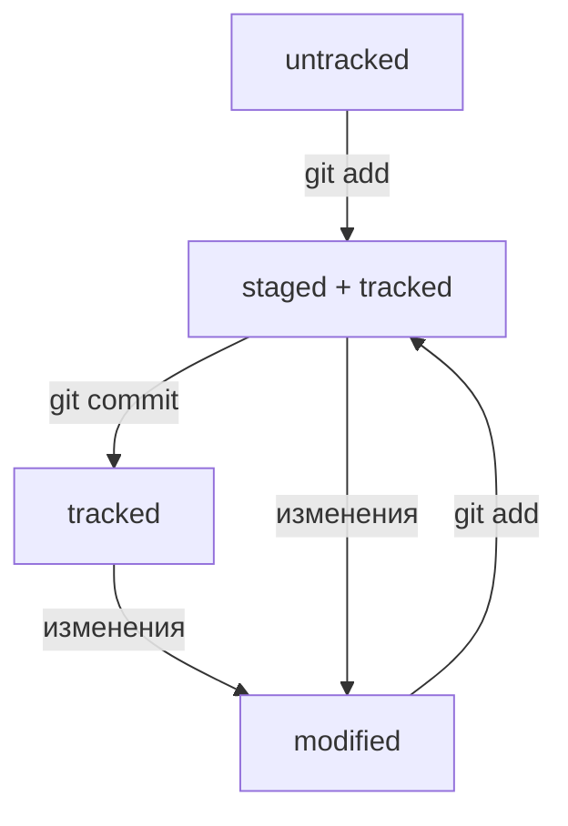

# Шпаргалка по работе с Git, GitHub и терминалом. MacOS

## Работа с терминалом

**cd** | **c**hange **d**irectory

	~ | домашняя директория

	.. | подняться по директории

	/ | перейти в корневую директорию

**pwd** | **p**rint **w**orking **d**irectory

**ls** | **l**i**s**t directory contents

	-a | флаг для расширенного списка (со скрытыми файлами)

**touch** | создание пустого файла

**mkdir** | **m**a**k**e **dir**ectory

	-p | создать целую структуру файлов

**cp** | **c**o**p**y | копировать

**mv** | **m**o**v**e | переместить

**cat** | con**cat**enate and print | прочитать текстовый файл

**rm** | **r**e**m**ove | удалить

**rmdir** | **r**e**m**ove **dir**ectory | удалить директорию

	-r | recursive | удаляет папку и файлы в ней

**pbcopy** | копировать содержимое файла в буфер обмена

**echo <input>** | вывести input в терминале

	> <file> | перезаписать в файл

	>> <file> | добавить в конец файла

**&&** | позволяет объединять команды в список команд

### Выход из Vim

Esc --> :qa! --> Enter

## Работа с git

**git version** | версия гита

**git config --global user.name** | имя в файле конфигурации

**git config --global user.email** | электронная почта в конфигурации

**git config --list** | вывести содержимое конфигурации

**git init** | **init*ialize репозитория

**rm -rf .git** | разгитить папку

**git status** | состояние репозитория

	--ignored | посмотреть какие файлы игнорируются в .gitignored

**git diff** | просмотреть изменения до add

	--staged | сравнить с последним коммитом, после add

	<hash1> <hash2> | разница между коммитом с хешем <hash1> и <hash2>

**git add** | добавить файлы в репозиторий

	--all | добавить все файлы

	. | все файлы текущей директории

**git restore** | откатить изменения

	<file> | вернуть в состояние последнего коммита файл

	--staged | убрать файл(ы) из staged

		<file> | убрать файл

		. | все файлы текущей директории

**git commit** | коммит

	-m "message here" | новый коммит с сообщением

	--amend | изменить последний коммит

		--no-edit | без изменения сообщения коммита

		-m "new message" | изменить сообщение

**git reset --hard <commit hash>** | откатить коммит

**git log** | история коммитов

	--oneline | сокращенная

**git branch** | посмотреть ветки | "branch_name" создать ветку

**git checkout** | переключиться на ветку

	-b | создать ветку и сразу переключиться

### Жизнь файлов в git'е

1. Файл только что создали. Git про него ещё ничего не знает. Состояние: untracked.
2. Файл добавили в staging area с помощью git add. Состояние: staged (+ tracked). 
	- Возможно, изменили файл ещё раз. Состояния: staged, modified (+ tracked). Обратите внимание: staged и modified у одного файла, но у разных его версий.
	- Ещё раз выполнили git add. Состояние: staged (+ tracked).
3. Сделали коммит с помощью git commit. Состояние: tracked.
4. Изменили файл. Состояние: modified (+ tracked).
5. Снова добавили в staging area с помощью git add. Состояния: staged (+ tracked).
6. Сделали коммит. Состояния: tracked.
7. Повторили пункты 4−7 много-много раз.

### Оформление сообщений коммитов

**feat**: какой новый функционал

**fix**(раздел кода): исправление каких ошибок

## Работа с GitHub

1. Генерация SSH ключа (приватный и публичный)

	**ls -a ~/.ssh** | вывести созданные ключей

	**ssh-keygen -t ed25519 -C "электронная почта, к которой привязан ваш аккаунт на GitHub"** | генерация SSH-пары по алгоритму шифрования **ed25519**

2. Скопировать содержимое ключа в GitHub/SSH keys

	**ssh -T git@github.com** | проверить правильность ключа

3. Связать удаленный репозиторий с локальным по типу SSH 

	- скопировать SSH с GitHub
	- ввести в терминале **git remote add origin "SSH"**
	- убедиться что репозитории связаны **git remote -v**

4. Отправить версию в GitHub

	**git push** | загрузка содержимого локального репозитория

### Работа с чужим репозиторием

**git clone <ssh-keygen>** | клонировать репозиторий локально

